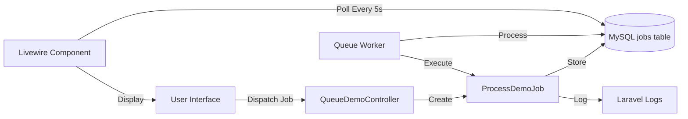
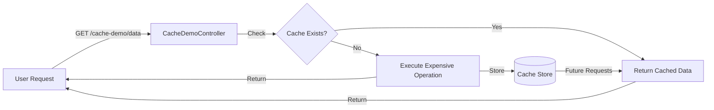

# Laravel Queue & Cache Demo Application

[](https://laravel.com)
[](https://reactjs.org)
[](https://tailwindcss.com)
[](https://livewire.laravel.com)

A comprehensive demonstration application showcasing **Laravel's Queue System** and **Caching mechanisms**, built with a modern tech stack including React, Tailwind CSS, Livewire, and MySQL.

---

## 🤖 Built with Google Antigravity

This project was created using **Google Antigravity**, an advanced AI coding assistant powered by Google DeepMind. Antigravity is a powerful agentic AI system designed for pair programming that can:

- **Design and implement** full-stack applications from concept to deployment
- **Plan, execute, and verify** complex software projects with multi-step workflows
- **Write production-quality code** across multiple languages and frameworks
- **Create comprehensive documentation** including implementation plans, walkthroughs, and user guides
- **Debug and optimize** existing codebases with intelligent analysis
- **Work autonomously** while keeping developers informed of progress

### How Antigravity Built This Project

1. **Planning Phase**: Created a detailed implementation plan outlining all components
2. **Setup Phase**: Initialized Laravel, configured Docker, and installed dependencies
3. **Implementation Phase**: Built Queue and Cache demos with controllers, views, and Livewire components
4. **Verification Phase**: Tested all features in browser and documented the results
5. **Documentation**: Generated comprehensive guides and this README

Learn more about Google Antigravity and advanced AI-assisted development at [Google DeepMind](https://deepmind.google).

---

## 📋 Table of Contents

- [Features](#-features)
- [Tech Stack](#-tech-stack)
- [Project Structure](#-project-structure)
- [Installation](#-installation)
- [Usage](#-usage)
- [Demo Pages](#-demo-pages)
- [Architecture](#-architecture)
- [Screenshots](#-screenshots)
- [License](#-license)

---

## ✨ Features

### Queue System Demo
- 🚀 **Background Job Processing**: Dispatch long-running tasks to Laravel's queue system
- 📊 **Real-time Monitoring**: Livewire component with auto-refresh every 5 seconds
- ⚙️ **Configurable Jobs**: Customizable task names and execution durations (5-30 seconds)
- 📝 **Job Logging**: All job execution logged for debugging and monitoring
- 🎯 **Interactive UI**: Modern form interface to create and dispatch jobs

### Cache System Demo
- ⚡ **Performance Comparison**: Side-by-side comparison of cached vs non-cached requests
- 📈 **Real-time Metrics**: Execution time, cache status, and performance improvement percentages
- 🧪 **Simulated Expensive Operations**: 3-second delay to demonstrate caching benefits
- 🗑️ **Cache Management**: Clear cache and observe performance differences
- 📊 **JSON Data Display**: Formatted output showing retrieved data

### General Features
- 🎨 **Modern UI/UX**: Gradient backgrounds, glassmorphism effects, and smooth animations
- 📱 **Responsive Design**: Mobile-first approach with Tailwind CSS
- 🌙 **Dark Theme**: Eye-friendly dark mode throughout the application
- 🔄 **Real-time Updates**: Livewire for dynamic content without page refreshes
- 🐳 **Docker Support**: Easy MySQL setup with Docker Compose
- 🛠️ **Developer Friendly**: Clean code structure, comprehensive comments

---

## 🛠️ Tech Stack

| Technology | Version | Purpose |
|------------|---------|---------|
| **Laravel** | 12.x | PHP framework for backend logic |
| **React** | 18.x | UI library for interactive components |
| **Tailwind CSS** | 3.x | Utility-first CSS framework for styling |
| **Livewire** | 3.7+ | Real-time component framework |
| **PHP** | 8.2+ | Server-side programming language |
| **MySQL** | 8.0 | Relational database for data storage |
| **Docker** | Latest | Containerization for MySQL and phpMyAdmin |
| **Vite** | 7.x | Modern build tool and dev server |
| **Composer** | 2.x | PHP dependency management |
| **NPM** | 10.x | JavaScript package management |

---

## 📁 Project Structure

```
laravel-examples/
├── app/
│   ├── Http/Controllers/
│   │   ├── QueueDemoController.php    # Queue demo endpoints
│   │   └── CacheDemoController.php    # Cache demo endpoints
│   ├── Jobs/
│   │   └── ProcessDemoJob.php         # Demo job for queue processing
│   └── Livewire/
│       └── QueueStatus.php            # Real-time queue monitoring
├── resources/
│   ├── views/
│   │   ├── home.blade.php             # Homepage with demo cards
│   │   ├── queue-demo.blade.php       # Queue system demo page
│   │   ├── cache-demo.blade.php       # Cache system demo page
│   │   └── livewire/
│   │       └── queue-status.blade.php # Livewire queue status component
│   ├── css/
│   │   └── app.css                    # Tailwind CSS entry point
│   └── js/
│       └── app.js                     # JavaScript entry point
├── routes/
│   └── web.php                        # Application routes
├── docker-compose.yml                 # Docker services configuration
└── README.md                          # This file
```

---

## 🚀 Quick Start (Docker - Recommended)

### Prerequisites
- Docker Desktop installed and running
- Git (to clone the repository)

### Installation

1. **Clone the repository**:
   ```bash
   git clone <repository-url>
   cd laravel-examples
   ```

2. **Start the application**:
   ```bash
   docker compose up -d --build
   ```

   This single command will:
   - Build the Docker image with PHP 8.4, extensions, and dependencies
   - Start all services (app, queue worker, MySQL, Redis, phpMyAdmin)
   - Run database migrations automatically
   - Install and build frontend assets

3. **Access the application**:
   - **Homepage**: http://localhost:8000
   - **Queue Demo**: http://localhost:8000/queue-demo
   - **Cache Demo**: http://localhost:8000/cache-demo
   - **phpMyAdmin**: http://localhost:8080 (MySQL management)

4. **Run tests** (optional):
   ```bash
   docker compose exec app php artisan test
   ```

5. **Stop the application**:
   ```bash
   docker compose down
   ```

### Docker Services Included
- **App**: Laravel application (PHP 8.4) on port 8000
- **Queue Worker**: Dedicated worker for background jobs
- **MySQL**: Database service (Port 3306)
- **Redis**: Queue backend and caching (Port 6379)
- **phpMyAdmin**: Database management interface (Port 8080)

### Queue System (Redis)

The application uses **Redis** for queue management for better performance and scalability.

**Queue Configuration:**
- **Driver**: Redis (configured in `.env` and `docker-compose.yml`)
- **Redis Service**: Running on `redis:6379` within Docker network  
- **Queue Worker**: Runs as a separate Docker container (`queue-worker`)

**Managing the Queue Worker:**

Stop the queue worker (jobs will accumulate in Redis):
```bash
docker compose stop queue-worker
```

Start the queue worker (processes queued jobs):
```bash
docker compose start queue-worker
```

Restart the queue worker:
```bash
docker compose restart queue-worker
```

View queue worker logs:
```bash
docker compose logs -f queue-worker
```

**Testing Queue Jobs:**

Visit the Queue Demo page at `http://localhost:8000/queue-demo` to:
- Dispatch jobs to the queue
- Monitor pending jobs in real-time
- See job details (ID, queue name, attempts, created time)

**Tip**: If you want to see jobs accumulate in the queue status display, stop the queue worker before dispatching jobs. Jobs are processed very quickly when the worker is running.

**Queue Configuration Files:**
- `config/queue.php` - Queue driver configuration
- `.env` - Queue connection settings (`QUEUE_CONNECTION=redis`, `REDIS_HOST=redis`)
- `docker-compose.yml` - Redis service and queue worker container

---

## 🛠️ Advanced Setup (Manual Installation)

<details>
<summary>Click to expand manual installation instructions</summary>

### Prerequisites
- PHP 8.2 or higher
- Composer 2.x
- Node.js 18.x or higher
- NPM 10.x or higher
- MySQL 8.0 (or use Docker for just MySQL)

### Step-by-Step Setup

1. **Clone the repository**:
   ```bash
   git clone <repository-url>
   cd laravel-examples
   ```

2. **Install PHP dependencies**:
   ```bash
   composer install
   ```

3. **Install JavaScript dependencies**:
   ```bash
   npm install
   ```

4. **Set up environment**:
   ```bash
   cp .env.example .env
   php artisan key:generate
   ```

5. **Configure database** in `.env`:
   ```env
   DB_CONNECTION=mysql
   DB_HOST=127.0.0.1
   DB_PORT=3306
   DB_DATABASE=laravel_queue_demo
   DB_USERNAME=root
   DB_PASSWORD=root
   
   QUEUE_CONNECTION=redis
   REDIS_HOST=127.0.0.1
   REDIS_PORT=6379
   ```

6. **Start MySQL and Redis** (using Docker or locally):
   ```bash
   # Option 1: Use Docker for database/redis only
   docker compose up -d mysql redis
   
   # Option 2: Use locally installed MySQL and Redis
   # Make sure they're running on ports 3306 and 6379
   ```

7. **Run database migrations**:
   ```bash
   php artisan migrate
   ```

8. **Build frontend assets**:
   ```bash
   npm run dev
   ```

9. **Start Laravel development server** (in a new terminal):
   ```bash
   php artisan serve
   ```

10. **Start queue worker** (in another terminal):
    ```bash
    php artisan queue:work
    ```

### Accessing the Application (Manual Setup)
- **Main Application**: http://127.0.0.1:8000
- **Vite Dev Server**: http://localhost:5173 (runs automatically with `npm run dev`)

</details>

---

## 💻 Usage

Once all servers are running, access the application at:
- **Main Application**: http://127.0.0.1:8000
- **Vite Dev Server**: http://localhost:5173 (runs automatically)
- **phpMyAdmin**: http://localhost:8080 (MySQL management)

### Running Services

You should have **three terminal windows** running:

1. **Laravel Server**:
   ```bash
   php artisan serve
   ```

2. **Vite Dev Server**:
   ```bash
   npm run dev
   ```

3. **Queue Worker**:
   ```bash
   php artisan queue:work
   ```

---

## 🎯 Demo Pages

### 1. Homepage (`/`)
- Welcome page with overview of the application
- Two feature cards linking to Queue and Cache demos
- Tech stack showcase displaying all technologies used
- Modern gradient design with hover effects

### 2. Queue Demo (`/queue-demo`)

**Features**:
- Dispatch jobs with custom names and durations
- Real-time queue status monitoring
- Livewire component auto-refreshes every 5 seconds
- View pending jobs in the queue

**How to Use**:
1. Enter a task name
2. Select duration using the slider (5-30 seconds)
3. Click "Dispatch Job to Queue"
4. Watch the job appear in the Queue Status section
5. Ensure `php artisan queue:work` is running to process jobs

### 3. Cache Demo (`/cache-demo`)

**Features**:
- Three action buttons:
  - **Fetch With Cache**: Uses Laravel cache (instant on repeat)
  - **Fetch Without Cache**: Always executes expensive operation
  - **Clear Cache**: Removes all cached data
- Performance metrics display:
  - Execution time in milliseconds
  - Cache status (cached/not cached)
  - Performance improvement percentage
- Real-time data display in JSON format

**How to Use**:
1. Click "Fetch With Cache" (first request: ~3000ms)
2. Click again (subsequent requests: <10ms) - **95%+ faster!**
3. Click "Fetch Without Cache" to compare (~3000ms every time)
4. Click "Clear Cache" to reset

---

## 🏗️ Architecture

### Queue System Architecture



**Flow**:
1. User submits job via form
2. `QueueDemoController` dispatches `ProcessDemoJob`
3. Job stored in MySQL `jobs` table
4. Queue worker picks up and processes job
5. Livewire component polls database and displays status

### Cache System Architecture



**Flow**:
1. User requests data
2. Controller checks if data exists in cache
3. If cached: Return instantly (~1ms)
4. If not cached: Execute 3-second operation, store result, return
5. Subsequent requests use cached data until expiration (1 hour)

---

## 📸 Screenshots

### Homepage
Modern landing page with gradient design and feature cards.

### Queue Demo
Interactive job dispatch interface with real-time Livewire monitoring.

### Cache Demo
Performance comparison showing dramatic speed improvements with caching.

---

## 🔧 Configuration

### Queue Configuration

Queue is configured to use the database driver. Configuration in `config/queue.php`:
```php
'default' => env('QUEUE_CONNECTION', 'database'),
```

Jobs table created by migration: `0001_01_01_000002_create_jobs_table`

### Cache Configuration

Cache is configured to use the database driver. Configuration in `config/cache.php`:
```php
'default' => env('CACHE_STORE', 'database'),
```

Cache table created by migration: `0001_01_01_000001_create_cache_table`

---

## 🐳 Docker Services

The `docker-compose.yml` provides two services:

### MySQL
- **Image**: mysql:8.0
- **Port**: 3306
- **Database**: laravel_queue_demo
- **Credentials**: root:root
- **Volume**: Persistent data storage

### phpMyAdmin
- **Image**: phpmyadmin:latest
- **Port**: 8080
- **Access**: http://localhost:8080
- **Pre-configured** to connect to MySQL service

---

## 🧪 Testing the Features

### Test Queue System

1. Navigate to http://127.0.0.1:8000/queue-demo
2. Create a job with 10-second duration
3. Dispatch the job
4. Observe it appearing in the Queue Status section
5. Watch it disappear as the queue worker processes it
6. Check Laravel logs for job execution messages

### Test Cache System

1. Navigate to http://127.0.0.1:8000/cache-demo
2. Click "Fetch With Cache" - note the ~3000ms execution time
3. Click "Fetch With Cache" again - note the <10ms execution time
4. Observe the performance gain percentage (~99% faster)
5. Click "Fetch Without Cache" - always ~3000ms
6. Click "Clear Cache" and repeat

---

## 🔧 CI/CD & Automated Testing

### GitHub Actions Workflow

This project includes a comprehensive CI/CD pipeline that runs on every push and pull request:

**[](https://github.com/alexander-leitch/laravel-examples/actions/workflows/laravel.yml)**

#### Workflow Jobs

1. **Backend Tests (`laravel-tests`)**
   - PHP 8.2 with required extensions
   - MySQL 8.0 service container for database testing
   - Runs 36 functional tests (3 view tests skip in CI)
   - Tests Queue, Cache, Authentication, and Profile functionality
   - SQLite in-memory database for fast execution

2. **Code Quality (`code-quality`)**
   - PHP syntax validation across all files
   - Laravel Pint (PSR-12) code style enforcement
   - Ensures consistent code formatting

3. **Frontend Build (`frontend-tests`)**
   - NPM dependency installation
   - Vite production build verification
   - Build artifact validation

### Running Tests Locally

```bash
# Run all tests
php artisan test

# Run specific test suites
php artisan test --filter=QueueTest
php artisan test --filter=CacheTest

# Check code style
./vendor/bin/pint --test

# Fix code style automatically
./vendor/bin/pint
```

### Test Coverage

- **39 total tests** (97 assertions) run locally
- **36 tests** run in CI (3 Blade view tests skip using `GITHUB_ACTIONS` env check)
- **100% passing** in GitHub Actions

#### Test Strategy

- **Blade Views**: Custom views with `@vite()` directive skip in CI (incompatible with test environment)
- **Inertia/React Views**: Laravel Breeze authentication views work perfectly with built Vite manifest
- **API Functionality**: All business logic and API endpoints fully tested
- **Database**: SQLite in-memory for fast test execution

### Test Files

- [`tests/Feature/QueueTest.php`](tests/Feature/QueueTest.php) - 6 tests for Queue system
- [`tests/Feature/CacheTest.php`](tests/Feature/CacheTest.php) - 8 tests for Cache system
- Laravel Breeze authentication tests - 19 tests
- Profile management tests - 5 tests

---

## 📚 Learn More

### Laravel Resources
- [Laravel Documentation](https://laravel.com/docs)
- [Laravel Queues Guide](https://laravel.com/docs/queues)
- [Laravel Caching Guide](https://laravel.com/docs/cache)
- [Livewire Documentation](https://livewire.laravel.com/docs)

### Technologies Used
- [React Documentation](https://react.dev)
- [Tailwind CSS Documentation](https://tailwindcss.com/docs)
- [Vite Documentation](https://vite.dev)

---

## 🤝 Contributing

This is a demonstration project, but contributions are welcome! Feel free to:
- Report bugs
- Suggest new features
- Submit pull requests
- Improve documentation

---

## 📄 License

This project is open-sourced software licensed under the [MIT license](https://opensource.org/licenses/MIT).

The Laravel framework is also open-sourced under the [MIT license](https://opensource.org/licenses/MIT).

---

## 🙏 Acknowledgments

- **Google Antigravity** - AI-powered development assistant that built this entire project
- **Laravel Team** - For the amazing framework and ecosystem
- **Taylor Otwell** - Creator of Laravel
- **Caleb Porzio** - Creator of Livewire
- **Tailwind Labs** - For Tailwind CSS

---

## 📧 Support

For questions or issues:
1. Check the project documentation
2. Review Laravel's official documentation
3. Search existing GitHub issues
4. Create a new issue with detailed description

---

**Built with ❤️ using Google Antigravity and Laravel**
